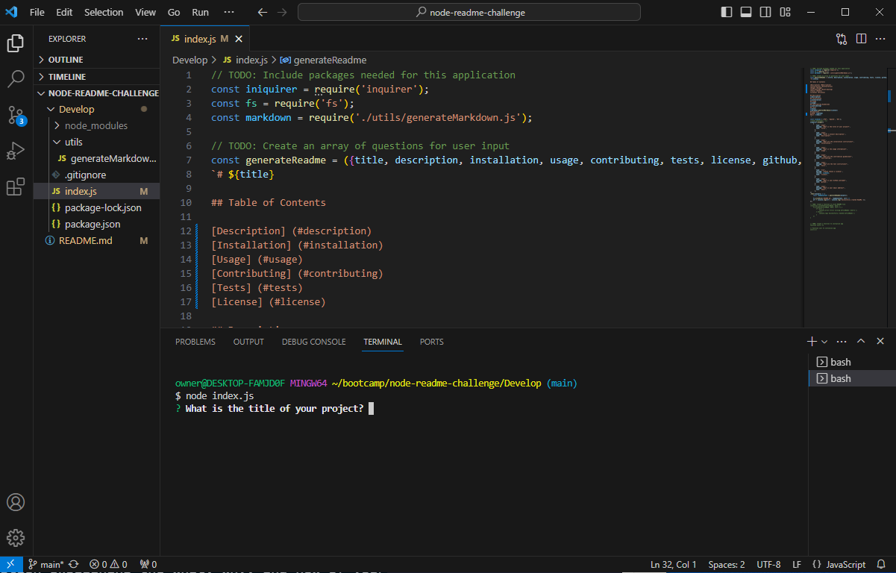
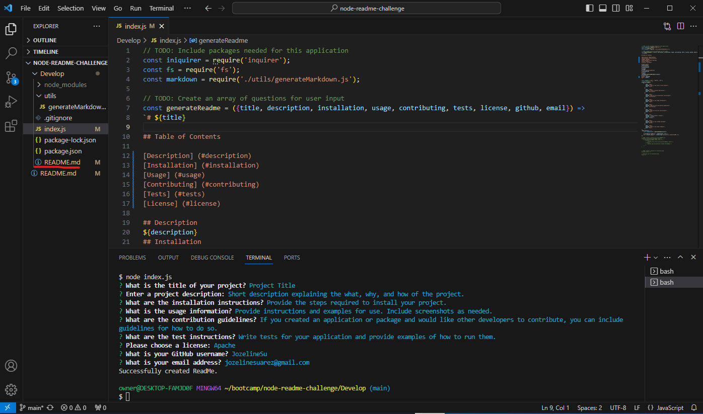

# Professional README Generator

Developers can use this to quickly make  a professional README file for their new project.

## Usage

You will go into your terminal in your code editor and type in 'node index.js'

After answering the prompts, the READEME file will be generated.

## Credits

Starter code from: https://github.com/coding-boot-camp/potential-enigma.git
License Badges from: https://gist.github.com/lukas-h/2a5d00690736b4c3a7ba
[How to create a Professional README](https://coding-boot-camp.github.io/full-stack/github/professional-readme-guide)
